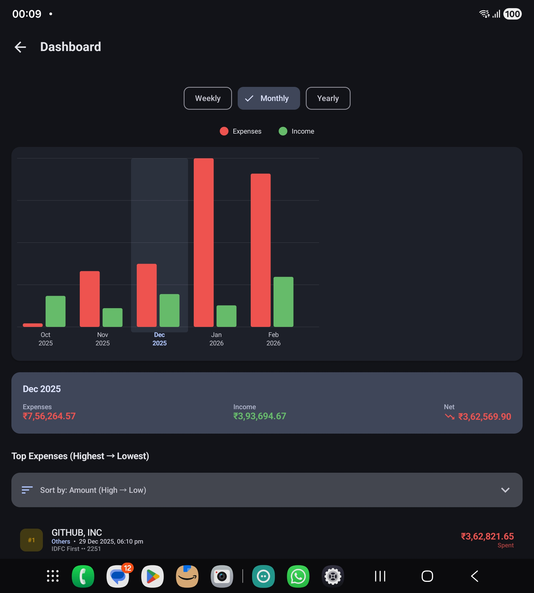
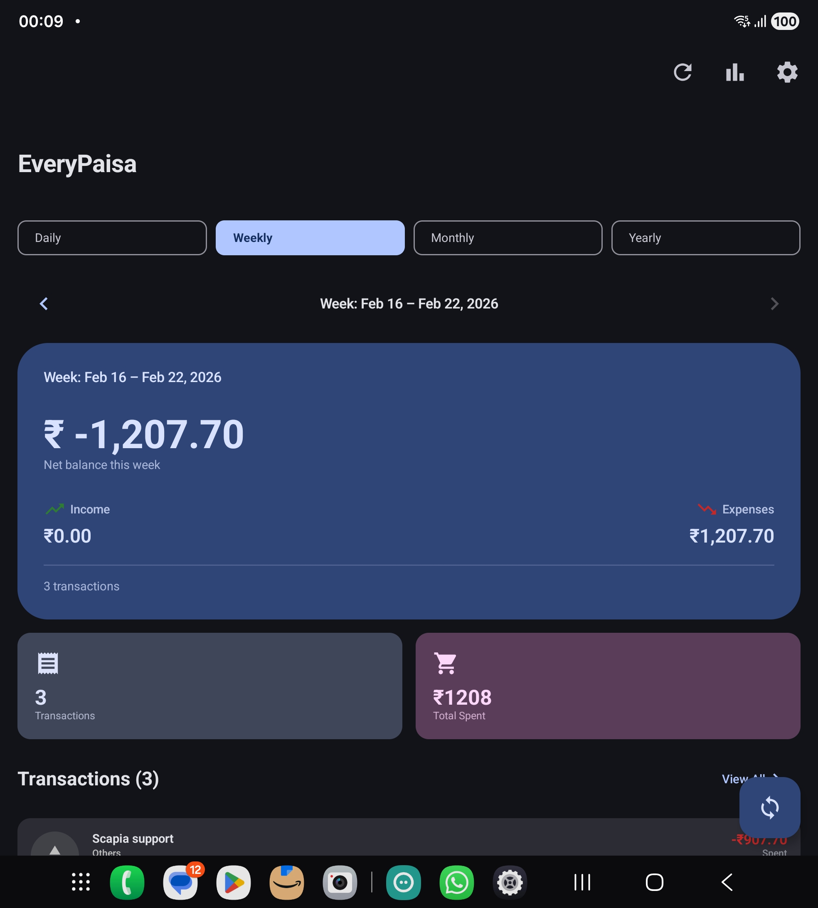

# EveryPaisa 💰

<p align="center">
  
</p>

<p align="center">
  <strong>Every paisa accounted for — automatically.</strong>
</p>

<p align="center">
  
  
  
  
  
  
</p>

---

## 📋 Changelog

### Version 1.1.0 (February 18, 2026)

#### 🎨 **Comprehensive Category System**
- Added **30+ spending categories** covering global spending patterns
- **New Categories**: Subscriptions, Gym/Fitness, Rent, Insurance, Gifts, Charity, Pets, Coffee/Tea, Alcohol, Gaming, Books, Fashion, Electronics, Furniture, Pharmacy, Parking, Laundry
- Each category has unique **Material Design icons** and **color coding**
- Circle background with category color at 15% opacity for better visibility

#### 🤖 **Enhanced Auto-Categorization**
- Smart merchant detection for **100+ popular merchants**
- **Subscriptions**: Netflix, Prime Video, Spotify, Hotstar, YouTube Premium, Apple Music
- **Fitness**: Cult.fit, gyms, sports centers
- **Food & Beverages**: Coffee shops (Starbucks, CCD), restaurants (Swiggy, Zomato, McDonald's, KFC)
- **Travel**: MakeMyTrip, IRCTC, Goibibo, OYO, airlines
- **Telecom**: Airtel, JIO, VI, broadband providers
- **Shopping**: Amazon, Flipkart, Myntra, AJIO
- **Groceries**: Blinkit, BigBasket, Zepto, Dunzo, Instamart
- **Education**: Udemy, Coursera, schools
- **Healthcare**: Hospitals, pharmacies, clinics

#### 🐛 **Bug Fixes**
- Fixed app crash when clicking transactions in "View All" screen
- Disabled navigation to non-existent transaction detail screen (temporary fix)
- Removed broken transaction detail route to prevent crashes

#### 🎯 **Category Icons Added**
- Restaurant (Food & Dining)
- Coffee Cup (Coffee/Tea)
- Grocery Store (Groceries)
- Shopping Bag (Shopping)
- Car (Transportation)
- Receipt (Bills & Utilities)
- Movie (Entertainment)
- Hospital (Healthcare)
- Plane (Travel)
- School (Education)
- Subscriptions badge (Subscriptions)
- Spa (Personal Care/Beauty)
- Trending Up (Investments)
- Bank (Salary/Income)
- Money Off (Refunds)
- Gift Card (Gifts)
- Volunteer (Charity/Donation)
- Paw (Pets)
- Bar (Alcohol/Drinks)
- Phone (Mobile/Recharge)
- WiFi (Internet/Broadband)
- TV (Streaming/OTT)
- Gaming Controller (Games)
- Book (Books/Reading)
- Checkroom (Clothes/Fashion)
- Devices (Electronics)
- Weekend (Furniture)
- Pharmacy (Medicine)
- Parking (Parking)
- Laundry Service (Laundry)

#### 💾 **Technical Updates**
- Enhanced `categorizeMerchant()` function with 150+ merchant keywords
- Updated `getCategoryIcon()` with 30+ icon mappings
- Updated `getCategoryColor()` with unique colors for each category
- Improved merchant name matching with case-insensitive checks

### Version 1.0.0 (Previous Releases)
- Initial release with SMS parsing
- Multi-currency support (INR, USD, EUR, GBP, AED, etc.)
- Biometric app lock
- Failed transaction handling
- Analytics dashboard
- 35+ bank support

---

## 📖 Overview

**EveryPaisa** is a privacy-first Android expense tracker that automatically reads bank SMS messages and transforms them into a clean, searchable money timeline. Built with **100% on-device processing** — no cloud, no servers, no data ever leaves your phone.

### ✨ Key Features

- 🔒 **100% Privacy-First** — All processing happens on your device, zero internet required
- 🤖 **Automatic SMS Parsing** — Supports 35+ Indian banks, credit cards & UPI platforms
- 📊 **Smart Analytics** — Daily, weekly, monthly, yearly spending insights with interactive charts
- 💳 **Multi-Bank Support** — HDFC, ICICI, SBI, Axis, Kotak, IDFC First, and 30+ more
- 🎯 **Auto-Categorization** — Intelligent expense categorization with custom categories
- 🔄 **Failed Transaction Handling** — Automatically detects and processes refunds/reversals
- 🛡️ **SMS Filtering** — Filters out OTP, promotional, and non-transactional messages
- 🔐 **Biometric App Lock** — Secure your financial data with fingerprint/face unlock
- 🎨 **Material You Design** — Modern UI with dynamic theming and dark mode
- 📈 **Drill-Down Analytics** — Tap charts to view detailed transactions for any period
- 🔢 **Multi-Sort Options** — Sort by amount, date, or merchant name

---

## 🎯 Why EveryPaisa?

| Problem | EveryPaisa Solution |
|---------|---------------------|
| 😓 Manual expense entry is tedious | ✅ Fully automatic — zero manual entry |
| 🔓 Privacy concerns with cloud trackers | ✅ 100% on-device processing |
| 📱 Fragmented view across banking apps | ✅ Unified dashboard for all banks |
| ❌ Failed transactions not handled | ✅ Auto-detects reversals & creates refunds |
| 📧 OTP/promotional SMS clutter | ✅ Smart filtering of non-transactions |
| 📊 No spending insights | ✅ Rich analytics with period comparison |

---

## 🏗️ Architecture

EveryPaisa follows **Clean Architecture** principles with **MVVM** pattern:

```
┌─────────────────────────────────────────┐
│           Presentation Layer            │
│  (Jetpack Compose + ViewModels)        │
├─────────────────────────────────────────┤
│            Domain Layer                 │
│  (Use Cases + Repositories + Models)    │
├─────────────────────────────────────────┤
│             Data Layer                  │
│  (Room DB + SMS Parser + DataStore)    │
└─────────────────────────────────────────┘
```

### Tech Stack

- **UI**: Jetpack Compose with Material 3 (Material You)
- **Architecture**: MVVM + Clean Architecture + UDF (Unidirectional Data Flow)
- **DI**: Hilt (Dagger)
- **Database**: Room (SQLite) with TypeConverters
- **Async**: Kotlin Coroutines + Flow + StateFlow
- **Navigation**: Compose Navigation (type-safe)
- **Background**: WorkManager for SMS scanning
- **Biometric**: AndroidX Biometric API
- **Charts**: Pure Compose Canvas (no external dependencies)
- **Min SDK**: API 26 (Android 8.0)
- **Target SDK**: API 34 (Android 14)

### Module Structure

```
everypaisa-android/
├── app/                          # Main application module
│   ├── presentation/             # UI screens & ViewModels
│   │   ├── home/                # Home dashboard
│   │   ├── analytics/           # Analytics & charts
│   │   ├── transactions/        # Transaction list/detail
│   │   ├── settings/            # Settings & preferences
│   │   └── applock/             # Biometric lock screen
│   ├── domain/                   # Business logic & interfaces
│   │   ├── model/               # Domain models
│   │   └── repository/          # Repository interfaces
│   ├── data/                     # Data layer
│   │   ├── entity/              # Room entities
│   │   ├── dao/                 # Database DAOs
│   │   ├── repository/          # Repository implementations
│   │   └── sms/                 # SMS processing
│   └── di/                       # Dependency injection modules
│
└── parser-core/                  # SMS parser module (pure Kotlin)
    └── bank/                     # Bank-specific parsers (35+)
```

---

## 🚀 Getting Started

### Prerequisites

- Android Studio Hedgehog | 2023.1.1 or newer
- JDK 17 or higher
- Android SDK 34
- Kotlin 1.9.22+
- Gradle 8.2+

### Building the Project

1. **Clone the repository**
   ```bash
   git clone https://github.com/ikppramesh/EveryPaisa.git
   cd EveryPaisa
   ```

2. **Open in Android Studio**
   - Open Android Studio
   - Select "Open an Existing Project"
   - Navigate to the cloned directory

3. **Sync Gradle**
   - Android Studio will automatically sync Gradle
   - Wait for dependencies to download

4. **Build the APK**
   ```bash
   ./gradlew assembleDebug
   ```
   APK will be generated at: `app/build/outputs/apk/debug/app-debug.apk`

5. **Install on device**
   ```bash
   adb install -r app/build/outputs/apk/debug/app-debug.apk
   ```

---

## 📱 Features in Detail

### 🔍 SMS Parsing Engine

EveryPaisa includes a powerful SMS parser supporting **35+ banks**:

#### Supported Banks
- **Private Banks**: HDFC, ICICI, Axis, Kotak, IDFC First, Yes Bank, IndusInd, Federal Bank
- **Public Banks**: SBI, PNB, Canara, Bank of Baroda, Union Bank, Bank of India, Indian Bank
- **UPI Platforms**: Google Pay, PhonePe, Paytm, Amazon Pay, BHIM
- **Credit Cards**: AMEX, OneCard, and all major bank credit cards
- **Digital Banks**: Jupiter (CSB), AU Bank, Airtel Payments Bank

#### What Gets Parsed
- ✅ Amount (₹, $, د.إ, NPR, ETB)
- ✅ Merchant name
- ✅ Date & time
- ✅ Transaction type (Debit/Credit/Transfer)
- ✅ Bank name
- ✅ Account/Card last 4 digits
- ✅ Payment method (UPI/Card/NEFT/IMPS)

### 🛡️ Smart SMS Filtering

Automatically filters out non-transactional SMS:

- ❌ **OTP messages** — "Your OTP is 123456"
- ❌ **Balance inquiries** — "Your available balance is ₹15,000"
- ❌ **Credit limit changes** — "Your limit increased to ₹2,00,000"
- ❌ **Promotional messages** — "Download app for cashback"
- ❌ **Payment reminders** — "Bill due on 25th"
- ❌ **Account statements** — "Your e-statement is ready"

### 🔄 Failed Transaction Handling

Automatically detects and processes failed/reversed transactions:

1. **Detects keywords**: "failed", "declined", "reversed", "refunded"
2. **Finds original transaction** (last 30 days, matching amount/bank/account)
3. **Deletes failed expense**
4. **Creates refund transaction** (green/income) — "[Merchant] - Refund"

**Example:**
```
Original: "Rs 1500 debited for ZOMATO" → RED expense
Failed SMS: "Transaction failed. Will be refunded"
Result: Original removed + "ZOMATO - Refund" as GREEN income
```

### 📊 Analytics Dashboard

- **Period Selection**: Yearly, Monthly, Weekly views
- **Bar Charts**: Side-by-side expense vs income comparison
- **Drill-Down**: Tap any bar to view transactions for that period
- **Top Expenses**: Ranked list with merchant, category, bank, amount
- **Sort Options**: 6 different sort modes (Amount High→Low, Date Newest/Oldest, Merchant A→Z)
- **Visual Ranking**: Gold/Silver/Bronze badges for top 3 expenses

### 🔐 Security Features

- **Biometric App Lock**: Fingerprint/Face unlock on every app open
- **Lifecycle-Aware**: Locks when app goes to background
- **Fallback**: Device PIN/Pattern if biometric unavailable
- **Soft Delete**: Deleted transactions can be restored
- **Data Encryption**: All data encrypted at rest via device encryption

---

## 📚 Documentation

Comprehensive documentation is available in the root directory:

- **[PRD.md](PRD.md)** — Product Requirements Document with full feature specs
- **[ARCHITECTURE.md](ARCHITECTURE.md)** — Detailed technical architecture
- **[DESIGN_SPECIFICATIONS.md](DESIGN_SPECIFICATIONS.md)** — UI/UX design guidelines
- **[SMS_FILTERING_GUIDE.md](SMS_FILTERING_GUIDE.md)** — SMS filtering implementation details

---

## 🎨 Screenshots

<p align="center">
  
  
</p>

<p align="center">
  <em>Home Dashboard with transaction list | Analytics with bar charts</em>
</p>

---

## 🔒 Privacy & Security

### Our Privacy Promise

✅ **100% On-Device Processing** — All SMS parsing, categorization, and analytics happen locally  
✅ **Zero Internet Required** — No network permission, no cloud sync  
✅ **No Data Collection** — We never see your transactions  
✅ **No Analytics SDKs** — No Firebase, no Crashlytics, no tracking  
✅ **No Ads** — Never will be  
✅ **Open Data Model** — Export your data anytime as CSV  

### Play Store Data Safety

| Question | Answer |
|----------|--------|
| Does this app share data with third parties? | **No** |
| Does this app collect data? | **No data collected** |
| Is data encrypted? | **Yes** (device encryption) |
| Can users request data deletion? | **Yes** (Settings → Clear All Data) |

---

## 🛣️ Roadmap

### ✅ Completed (Current Version)
- [x] SMS permission & reading
- [x] 35+ bank parsers
- [x] Home dashboard with period selector
- [x] Transaction list with filters
- [x] Auto-categorization
- [x] Smart SMS filtering (OTP, promos, balance alerts)
- [x] Failed transaction reversal handling
- [x] Analytics screen with bar charts
- [x] Drill-down transaction views
- [x] Multi-sort options
- [x] Biometric app lock
- [x] Dark mode & Material You theming
- [x] Custom app icon

### 🚧 In Progress
- [ ] Subscription detection & tracking
- [ ] Budget management with category limits
- [ ] Multi-currency support with exchange rates
- [ ] Manual transaction entry
- [ ] Transaction splits across categories

### 🔮 Future Plans
- [ ] On-device AI chat assistant (MediaPipe + Qwen 2.5)
- [ ] Smart rules engine (IF-THEN automation)
- [ ] Account balance tracking
- [ ] Data export (CSV, PDF reports)
- [ ] Backup & restore
- [ ] Home screen widgets
- [ ] Merchant mapping improvements
- [ ] Multi-language support

---

## 🤝 Contributing

This is currently a **proprietary project** under active development. Contributions are not open at this time, but we're considering open-sourcing the `parser-core` module for community bank parser contributions in the future.

If you encounter issues or have feature requests, please open an issue on GitHub.

---

## 📄 License

**Proprietary License**  
Copyright © 2026 Ramesh Inampudi (iramesh.com). All rights reserved.

This software is proprietary and confidential. Unauthorized copying, distribution, modification, or use of this software, via any medium, is strictly prohibited without express written permission from Ramesh Inampudi.

---

## 🙏 Acknowledgments

- **Jetpack Compose** — Modern Android UI toolkit
- **Material Design 3** — Google's design system
- **Room Database** — Robust local persistence
- **Hilt** — Dependency injection framework
- **Kotlin Coroutines** — Asynchronous programming
- **Community** — All bank SMS format contributors

---

## 📞 Support

- **Issues**: [GitHub Issues](https://github.com/ikppramesh/EveryPaisa/issues)
- **Email**: hello@iramesh.com

---

## ⭐ Star History

If you find EveryPaisa useful, please consider starring the repository!

---

<p align="center">
  Made with ❤️ in India by <a href="https://iramesh.com">Ramesh Inampudi</a><br>
  <sub>For the Samsung Galaxy Fold 7 and beyond</sub>
</p>

<p align="center">
  <strong>Privacy-first. On-device. Always free.</strong>
</p>
   
   Or in Android Studio:
   - Build → Make Project (⌘F9)

4. **Generate APK**
   ```bash
   ./gradlew assembleDebug
   ```
   
   APK will be at:
   ```
   app/build/outputs/apk/debug/app-debug.apk
   ```

5. **Install on device**
   ```bash
   adb install app/build/outputs/apk/debug/app-debug.apk
   ```
   
   Or in Android Studio:
   - Run → Run 'app' (⌃R)

### Build Release APK (for production)

```bash
./gradlew assembleRelease
```

⚠️ **Note:** You'll need to set up signing keys for release builds.

## Current Development Status

### Phase 0: Project Setup ✅ COMPLETE
- [x] Gradle multi-module setup (app + parser-core)
- [x] Material 3 theme with dynamic colors
- [x] Navigation setup
- [x] Permission screen
- [x] Basic home screen

### Phase 1-7: In Progress
See [ARCHITECTURE.md](../ARCHITECTURE.md) for full roadmap.

## Testing on Samsung Fold 7

The app will automatically adapt to foldable screens using `WindowSizeClass`:
- **Compact (folded):** Standard phone UI
- **Expanded (unfolded):** Two-pane master-detail layouts

Phase 6 will add full foldable optimizations.

## Project Structure

```
everypaisa-android/
├── app/                    # Main application module
│   ├── src/main/
│   │   ├── java/com/everypaisa/tracker/
│   │   │   ├── EveryPaisaApp.kt
│   │   │   ├── MainActivity.kt
│   │   │   ├── navigation/
│   │   │   ├── presentation/
│   │   │   ├── ui/theme/
│   │   │   └── receiver/
│   │   └── res/
│   └── build.gradle.kts
├── parser-core/            # SMS parser module (pure Kotlin)
│   └── build.gradle.kts
├── gradle/libs.versions.toml
├── build.gradle.kts
└── settings.gradle.kts
```

## License

Proprietary - All Rights Reserved

## Contact

For issues or questions, please create an issue in the repository.
